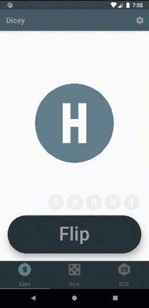
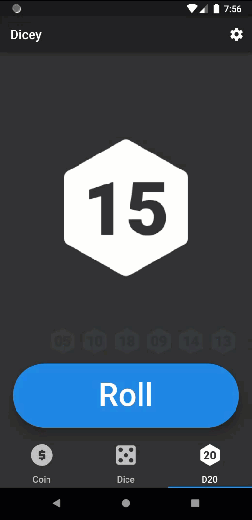
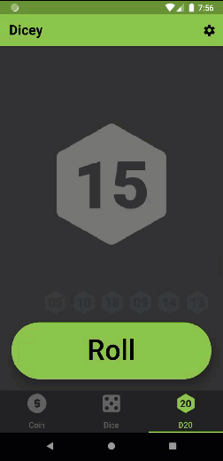
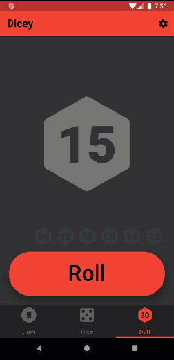

# flutter_dicey

## Video (YouTube)  

## Pics/Gifs

## Requirements
* Flutter/Dart
* AndroidStudio/VSCode
* A Device or Emulator to Run it on

## Feature
* Flip/Roll Animation
* HistoryList
* Theme / ThemeSaving
* Navigation
* icons (Android/iOS)
  
## Start Up

* Open the Project in AndroidStudio (or VSCode)  

* Open the pubspec.yaml and Click "Packages get"  
this will download the packages (plugins/addons) for this project  

* Run on Android or Emulator  

## Files 
this is a list of the dart files in the lib folder.

### main.dart
this is the file that starts up the app.  
it's responsible for setting up the dynamic themes, and the routes of all the screens in the app.

### home.dart
this is the file that sets up home screen, the app-bar and tabs.

### CoinPage.dart, DicePage.dart, D20Page.dart.
these pages contain the content for the Coin,Dice, and D20.

### constants.dart
this file contains the constants that are used my other dart files.

### settings.dart
this file contains the settings page for the app.

### themes.dart
this file contains all the different themes.

## known Issues
* history color doesn't update right away.